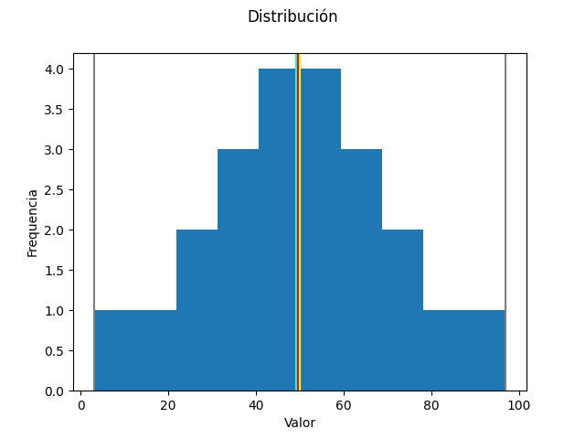
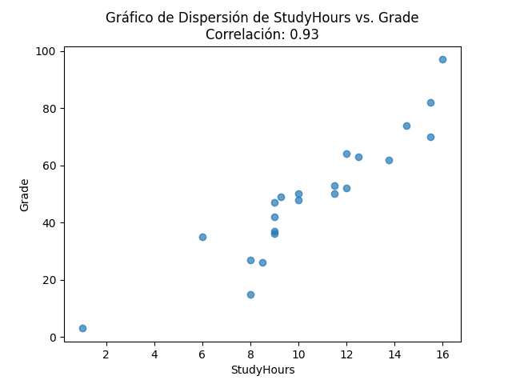

# Banregio - Entrevista Tecnica

Resultados del análisis de las horas dedicadas y las calificaciones obtenidas por los estudiantes utilizando la biblioteca de pandas en Python.

## Dependencias

El proyecto se implementó en Python y hace uso de las siguientes bibliotecas:

* pandas
* matplotlib
* numpy

## Dataset

El dataset que se utiliza se centra en un grupo de estudiantes e incluye información sobre las calificaciones obtenidas y la cantidad de tiempo que dedicaron al estudio. Este conjunto de datos consta de 23 filas, cada una de ellas con tres columnas que contienen el nombre del estudiante, las horas de estudio y la calificación obtenida.

| Name | StudyHours | Grade |
| ------------- | ------------- | ------------- |
| Dan | 10.0 | 50.0 |
| Joann | 11.50 | 50.0 |
| Pedro | 9.0 | 47.0 |

## Limpieza de filas con datos faltantes

El dataset contaba unicamente 2 filas con datos faltantes, por lo que se eliminaron estas filas:

| Name | StudyHours | Grade |
| ------------- | ------------- | ------------- |
| Bill | 8.0 | Nan |
| Ted | Nan | Nan |

## Promedio total y promedio de horas por estudiante

Se calculó el promedio total de horas de estudio de todos los estudiantes, obteniendo como resultado:"

10.522727 horas 

Dado que cada estudiante tiene un único registro en el conjunto de datos, el promedio de horas de estudio por estudiante sigue siendo el mismo.

| Name | StudyHours | MeanStudyHours |
| ------------- | ------------- | ------------- |
| Aisha | 12.00 | 10.522727 |
| Anila | 10.00 | 10.5227270 |
| Dan | 10.00 | 10.522727 |

## Asignacion de aprobacion a la materia

Se llevó a cabo una asignación de aprobación o no aprobación para todos los estudiantes en función de si su calificación fue igual o superior a 70. De los 21 estudiantes, solo 4 obtuvieron una calificación aprobatoria.

| Name | StudyHours | Grade | Approval |
| ------------- | ------------- | ------------- | ------------- |
| Rosie | 16.00 | 97.0 | True |
| Giovanni | 14.50 | 74.0 | True |
| Francesca | 15.50 | 82.0 | True |
| Jenny | 15.50 | 70.0 | True |

## Funcion para la obtencion de datos estadisticos

Se desarrolló una función para calcular el mínimo, máximo, promedio, mediana y moda a partir de una serie de datos, y se aplicó a las calificaciones de los estudiantes. Los resultados obtenidos fueron los siguientes:

* mínimo: 3.0
* máximo: 97.0 
* promedio: 49.1818
* mediana: 49.5
* moda: 50

## Histograma de las calificaciones

El histograma resultante al generar el gráfico con las calificaciones de los estudiantes se muestra en la imagen adjunta. A partir de este gráfico, se puede corroborar que el promedio, la mediana y la moda son prácticamente idénticos, lo que sugiere que las calificaciones siguen una distribución normal y están distribuidas de manera simétrica.

Donde el:

* Promedio es de color cyan.
* Mediana es de color rojo.
* Moda es de color amarillo.

## Boxplot de las calificaciones

Del análisis del gráfico de tipo caja, podemos destacar dos observaciones importantes. En primer lugar, podemos confirmar la información previamente mencionada, ya que la mediana se encuentra en el centro de la caja, lo que indica una concentración de calificaciones en un rango intermedio, acompañada de una dispersión moderada. En segundo lugar, se observa que la mayoría de las calificaciones se sitúan por debajo de 60, lo que sugiere que la gran mayoría de los alumnos no han obtenido calificaciones aprobatorias.

## Correlación entre las horas de estudio y las calificaciones.

Se aplicó una función para calcular la correlación entre las horas de estudio y las calificaciones, obteniendo un resultado de 0.93. Esto indica que a medida que las horas de estudio aumentan, las calificaciones tienden a ser más altas. En otras palabras, existe una relación directa y positiva entre el tiempo dedicado al estudio y las calificaciones.

## Propuesta de mejora.

Como hipótesis para una propuesta de mejora, se plantea aumentar el tiempo de estudio de los estudiantes con el objetivo de alcanzar un promedio de calificaciones en el rango de 80-90. Esto se haría con la intención de garantizar que la mayoría de los estudiantes logren aprobar sus exámenes.

### Créditos

|Autor:|Mario Eduardo Lara Loredo|
|:---: |:---:|
|Fecha:|30/09/2023|